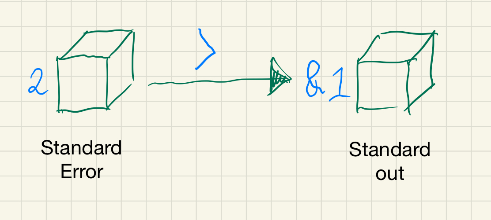

---
author:
- Todd Moore
subtitle: How to get the most out of bash
title: Bash Scripting Workshop 1
titlepage-note: |
	- Discuss the benefits of bash for understanding buildkite
	- Running build scripts and understanding why errors arise
	- How everything we do ultimately starts in the shell
fontsize: 15pt
---

# Unix

## How did programs input data originally?

Originally, before UNIX, programs had to explicitly connect to input and
output devices. Specific details of how a punchcard reader, for example,
would be required to load input for a particular program. This was obviously
a pretty tedious task.

\note{}

## Punchcard 


\note{}

## Unix Abstract devices

With the advent of abstract devices in UNIX, the above problem was solved and data
input was abstracted into a stream of bytes with an EOF (End of File)
character.

\note{}

## Standard Input
- Standard input is stream data (often text) going into a program
- It's file descriptor is **0** (zero)

\note{}

## Standard Output
- Standard output is the stream where a program writes its output data. 
- Not all programs generate output.
- One example of standard out is the list of files from ~ls~
- Or if you ~echo "hello, world", "hello, world" is written to standard out
- The file descriptor is **1**.

\note{}

## Standard Error
- Standard error is another output stream typically used by programs to
  output error messages or diagnostics.
- It's mostly used to differentiate between normal output and output that
  represents an error. 
- It's pretty much the same as standard output except for that it's written
  to a different stream for differentiation.
- The file descriptor is **2**

\note{}

## Pipelines
### What is a pipeline?
- A pipeline is a sequence of one or more commands separated by one of the control operators `|` or `|&`.
- The output of each command in the pipeline is connected via a pipe to the input of the next command. That is, each command reads the previous command’s output. 

``` {.bash}
$ git log | grep "v1.0.0"
```

## Redirection
### What does `2>&1` mean?

You may oten see the above in scripts usually in the format of something like `> /dev/null 2>&1`

This might seem a bit cryptic at first, but it essentially means send all
output of the running program to the blackhole `/dev/null` and include both
`standard error` & `standard output`. You may want to only send standard
output to dev null and that would be `1>/dev/null`. Or maybe just standard
error `2>/dev/null`

\note{}

## Redirection Illustrated



# Exercises

```{.bash}
#!/usr/bin/env bash

# . "1.1.bash"
# . "2.0.bash"
# . "2.1.bash"
# . "2.2.bash"
...
```

## Exercise 1.1
```{.bash}
#!/usr/bin/env bash

redirect_to_std_out() {
  # 1. Change this to redirect to stderr
  echo "This is an error" >&1 | sed  "s/ is/ isn't/"
  
}

main() {
  redirect_to_std_out
}

main
```

## Answer 1.1
```{.bash}
#!/usr/bin/env bash

redirect_to_std_out() {
  # 1. Changed the file descriptor to 2
  echo "This is an error" >&2 | sed  "s/ is/ isn't/"
  
}

main() {
  redirect_to_std_out
}

main
```

# Bash

## Shebang! hashbang! pound-bang!
- The shebang is an interpreter directive
- It instructs the shell which interpreter to use to parse the script.

### Examples:
```{.bash}
#!/bin/sh 
#!/usr/bin/env python 
#!/bin/false 
```

\note{ 
Execute the file using the Bourne shell
Execute with a Python interpreter
Do nothing, but return a non-zero exit status
}

## The Set Builtin
Have you ever wondered what the following means

```{.bash}
#!/usr/local/env bash

set -e # What does this mean
```
`set` allows you to change the values of shell options and set the positional parameters, or to display the names and values of shell variables

If no options or arugments are supplied, `set` displays the names and values of all shell variables and functions.

## Exercise 2.0

```{.bash}
#!/usr/bin/env bash

# We want to see all the parameters 
# and options that are set in our shell, 
# how do we display these?

main() {
  echo "Hello, world"
}

main
```

## Answer 2.0

```{.bash}
#!/usr/bin/env bash

# We want to see all the parameters 
# and options that are set in our shell, 
# how do we display these?
set

main() {
  echo "Hello, world"
}

main
```

## -e
One of the most useful set options is `-e`. Dash `e` means **Exit immediately** and is useful particularly in ci or build scripts where you want errors to instantly stop a script from running and exit.

```{.bash}
#!/usr/bin/env bash

set -e
```

## Exercise 2.1
```{.bash}
#!/usr/bin/env bash

# This script will still echo Bar!
# even though foo doesn't exist!
# How can we make it exit so that bar 
# does not echo?

main() {
  foo
  echo "Bar!" 
}

main
```

## Answer 2.1
```{.bash}
#!/usr/bin/env bash

# By adding a set -e the script will exit
# immediately when it encounters an error
set -e

main() {
  foo
  echo "Bar!" 
}

main
```

## -o
You may often see in bash scripts a set option `-o`. Dash `o` means `option-name` and is an extension that only bash provides. Bourne shell, or `sh` does not have this option. So if your hash-bang is set to Bourne it will not understand this option. 

- `pipefail`: the return value of a pipeline is the value of the last (rightmost) command to exit with a non-zero status

## Exercise 2.2
```{.bash}
#!/usr/bin/env bash

# Currently this script will still echo Bar!
# Can you make it fail when the pipe fails?

set -e

main() {
  foo | echo "foo"
  echo "Bar!" 
}

main
```
## Answer 2.2
```{.bash}
#!/usr/bin/env bash

set -e
# Adding set -o pipfail will exit the script
# When that pipeline fails.
set -o pipefail

main() {
  foo | echo "foo"
  echo "Bar!" 
}

main
```
## -u
This option causes the bash shell to treat unset variables as an error and exit immediately. Unset variables are a common cause of bugs in shell scripts, so having unset variables cause an immediate exit is often highly desirable behavior.^[Tom Van Eyck, *Safer bash scripts with 'set -euxo pipefail'* (https://vaneyckt.io/posts/safer_bash_scripts_with_set_euxo_pipefail/).]

## Exercise 2.3
```{.bash}
#!/usr/bin/env bash

# Currently this script will still echo Bar!
# $foo is unset though, so that's not good.
# Can you make this script exit 1?

main() {
  echo $foo
  echo "Bar!"
}

main
```

## Answer 2.3
```{.bash}
#!/usr/bin/env bash

# Adding set -u will exit 
# If any unset variables are found
set -u

main() {
  echo $foo
  echo "Bar!"
}

main
```

## -x
The -x option causes bash to print each command before executing it. This can be a great help when trying to debug a bash script failure. Note that arguments get expanded before a command gets printed, which will cause our logs to contain the actual argument values that were present at the time of execution!^[Tom Van Eyck, *Safer bash scripts with 'set -euxo pipefail'* (https://vaneyckt.io/posts/safer_bash_scripts_with_set_euxo_pipefail/).]

## Exercise 2.4
```{.bash}
#!/usr/bin/env bash

# We want to debug this script
# How can we output each line of code
# Before execution so that we know
# Where our code has failed?
# This script must exit 127

main() {
  echo "Foo"
  foo
  echo "Bar!"
}

main
```
## Answer 2.4

```{.bash}
#!/usr/bin/env bash

set -xe

main() {
  echo "Foo"
  foo
  echo "Bar!"
}

main
```
